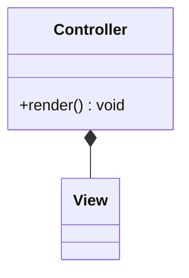

# Module name

One paragraph. What the editor gets, and what a visitor sees. Say if anything
runs in the browser rather than at render time, because nobody guesses that part.

## Files

| File | Purpose |
| --- | --- |
| `module.html` | HubL template. Also writes field values into custom properties on the root element |
| `module.css` | All styling |
| `module.js` | What the script does |
| `fields.json` | Editor fields |
| `meta.json` | Module metadata |

## Installing

```
hs upload YourModule.module "your-theme/modules/YourModule.module"
```

## Settings

### Content tab

- **Group name:** what the fields in it do, in the editor's words
- **Accessibility:** the screen reader wording an editor can change

### Styles tab

- **Colour:** …
- **Shape:** …

Say what an editor has to get right: which values are allowed, which fields
cannot be empty, what format a field expects.

## How it works

Three or four parts, each with a bold opening line and a short paragraph. This
section is for decisions that look wrong without context, so nobody "fixes" them
later:

**Why something runs in JS instead of HubL.** Pages are cached, so a value worked
out at render time is old when it is read.

**Why a value is written in a particular format.** Parsing traps, encoding,
anything where the obvious version fails quietly.

**Anything with an unusual DOM order or an extra wrapper,** and what breaks if
someone tidies it away.

## Structure

For anything with more than a couple of hundred lines of script, add a mermaid
class diagram. GitHub renders it from a fenced block:

````

````

Then a few lines on how to read it, and anything the diagram leaves out.

## The data contract

List the `data-` attributes that connect the markup and the script. This is what
lets you change where the data comes from without touching the JS.

## CSS conventions

Link to `CONVENTIONS.md`. Only note what is specific to this module: the prefix,
its breakpoints, and any custom property worth knowing about.

## Accessibility

Built to WCAG 2.2 Level AA. List the criteria the module handles, one line each,
naming the pattern rather than only the number.

Include the contrast table: every pair measured, what failed, what it is now.

| Pair | Was | Now |
| --- | --- | --- |
| … | … | … |

Finish with what no tool can check: alt text, and a manual pass with a screen
reader.

## Browser support

Name the modern features the module uses and the versions they need, such as
container queries, animated grid tracks or `inert`. Say what degrades quietly
and what breaks.

## Content limits

How many items before this approach stops working, and what to move to: HubDB,
server side filtering, or pagination.
